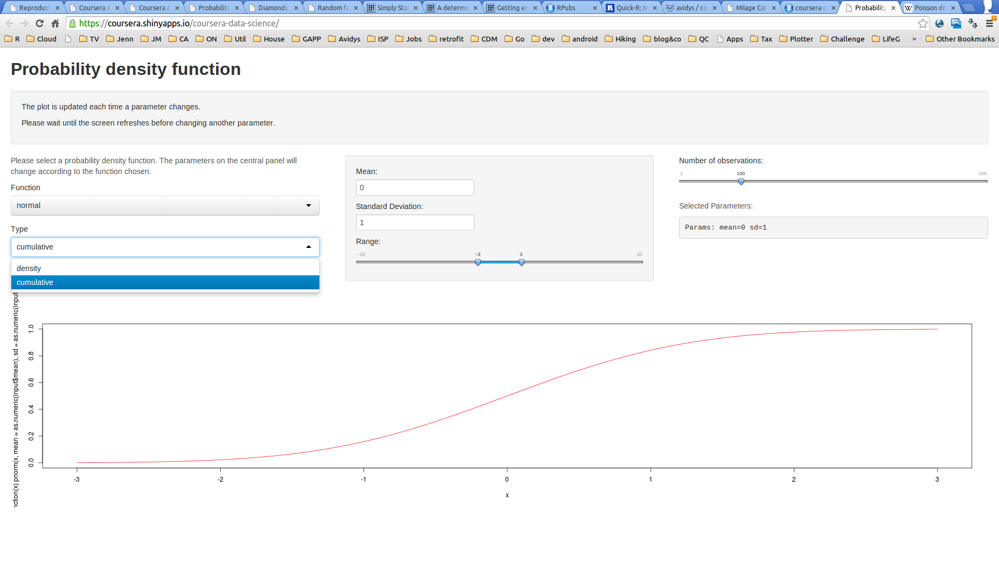

## Introduction

We developped an app plotting some of the probability density functions available in R.

The parameters necessary for each distribution adapt to the distribution chosen.

For example, if you want to draw a normal curve, the app asks for mean and sd. If you want to draw a Poisson curve, it asks for lambda.

Densities are drawn by generating observations (x) and calculating the density (d- function in R). 
Cumulative densities curves work by providing the plot function with the p- function (e.g. R pnorm).

--- .class #id 

## Probability Density Functions

R function and corresponding parameters:

    -     binom = size, prob
    -     chisq = df, ncp
    -     f     = df1, df2, ncp
    -     norm  = mean, sd
    -     hyper = m, n, k
    -     pois  = lambda
    -     t     = df, ncp
    -     unif  = min, max

---
## http://coursera.shinyapps.io/densities



The next 2 slides are trying some of slidify new functionalities.

---  &radio
## R Base

Which one is true about the Poisson distribution?

1. Defined as the number of successes in a sequence of n independent yes/no experiments.
2. Mean and Variance define the distribution, which is symetrical around the mean.
3. Defined as as the ratio of two scaled chi-squared variates.
4. The λ parameter is equal to the expected value of X and also to its variance.
5. Defined as the sum of the squares of k independent standard normal random variables.

*** .hint 
(k; lambda) = Pr(X=k) = lambda^k e^-lambda / k!

*** .explanation 
```{r echo= T}
x = seq(0,10); plot (x,dpois(x,lambda=3))
```

---  &radio
## R Base

What is the base R function or operator that concatenate 2 character vectors?

1. +
2. _paste_
3. glue
4. stick
5. concatenate

*** .hint 
tooth

*** .explanation 
```{r echo=TRUE}
cpaste("abc","qwe",sep="")
```

